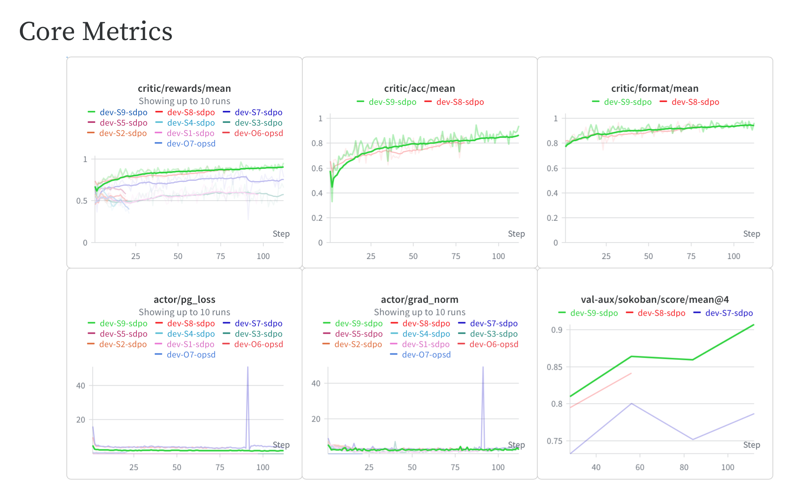

# Self-Distillation (SDPO)


Educational implementation of **SDPO — Self-Distillation Policy Optimization** for
[RLHF Book](https://rlhfbook.com), an on-policy distillation method for reasoning
tasks ([Hübotter et al., 2026](https://arxiv.org/abs/2601.20802)).
See the parent [`code/README.md`](../README.md) for installation, configuration, and memory requirements.

The student rolls out a [Reasoning Gym](https://github.com/open-thought/reasoning-gym)
task (the default is `spell_backward`, a string-reversal problem, matching the
[`policy_gradients`](../policy_gradients/README.md) GRPO setup) and each completion is
verified by the environment. The only in-context signal given to the self-teacher is a
*correct sibling demonstration* drawn from the same rollout group. If no rollout in the
group is correct, there is no demonstration to distil from and the prompt is **skipped
entirely** for that step.

## Algorithms

| Algorithm | Config | Key Idea |
|-----------|--------|----------|
| **SDPO** | `sdpo.yaml` | Self-Distillation Policy Optimization — distill a demonstration-conditioned self-teacher into the student via top-K reverse KL ([Hübotter et al., 2026](https://arxiv.org/abs/2601.20802)) |

## Reference Runs


`Qwen/Qwen3-1.7B` on the default `spell_backward` task, trained in under 20 hours on a
single 24 GB consumer GPU: `reward` rises from ~0.55 to ~0.8 while `loss` and
`grad_norm` trend down.

| Algorithm | wandb | Status |
|-----------|-------|--------|
| **SDPO** | _pending maintainer run_ | ✅ Trains; reference run ID pending publication |

## Quick Start

```bash
cd /path/to/rlhf-book/code
uv sync

# SDPO on the Reasoning Gym string-reversal task
uv run python -m distillation.train --config distillation/configs/sdpo.yaml
```

The dataset is generated procedurally by Reasoning Gym from the `data.specs` mixture
in the config (see [`data.py`](data.py)); swap or add tasks by editing those specs.

## Key configuration

See [`configs/sdpo.yaml`](configs/sdpo.yaml) for the full set. The most important knobs:

| Field | Default | Meaning |
|-------|---------|---------|
| `model_name` | `Qwen/Qwen3-1.7B` | Model used as both student and self-teacher |
| `data.specs` | `spell_backward` | Reasoning Gym task mixture (name / weight / per-task config) |
| `data.size` | `3000` | Number of procedurally generated problems |
| `kl_top_k` | `20` | Logits kept per position for the distillation KL |
| `success_reward_threshold` | `1.0` | Score at/above which a rollout becomes a demo solution |
| `num_rollouts` | `8` | Rollouts sampled per problem (sibling demos come from this group) |
| `prompts_per_step` | `4` | Problems generated and gradient-accumulated per optimizer step |
| `max_new_tokens` | `512` | Generation length cap per rollout |

## Metrics to watch

Logged to W&B each optimizer step (see [`train.py`](train.py)):

- **`avg_reward`** — mean environment score across the rollout group; the primary signal
  that the student is improving.
- **`loss`** — the masked top-K KL between student and self-teacher; should trend down
  as the student internalizes the demonstration-conditioned distribution.
- **`grad_norm`** — watch for spikes that indicate instability.

Steps whose prompts are all skipped (no correct demonstration in any group) produce no
update and are not logged.

## Hyperparameters for harder tasks

On harder datasets, usually run through a vendored fork of [verl](https://github.com/verl-project/verl)
(which is what the [original SDPO implementation](https://github.com/lasgroup/SDPO) is built on),
training gets much harder to keep stable. The reward line flatlines, or it climbs for a while and
then diverges. These are the settings we found to generally produce stable runs:

| Parameter | Value | Note |
|-----------|-------|------|
| Prompts per round | `32` | Questions per rollout budget |
| Rollouts per prompt | `8` | 256 completions per round |
| Mini batch size | `2` prompts | **Biggest lever.** 16 optimizer steps per round, not 1 |
| Max completion length | `8192` | Truncation reads as failure, starves the demo pool |
| Learning rate | `1e-6` | Flat, no schedule |
| Weight decay | `0.01` | Standard AdamW value |
| Optimizer | AdamW | Good starting point |
| Gradient clip norm | `1.0` | Gradient spikes are inevitable |
| Teacher | EMA of the student, `alpha = 0.01` | No frozen teacher |
| Teacher IS clip | `2.0` | Caps teacher/student ratio |
| Rollout IS | token-level, clip `2.0` | Off-policy correction within a round |
| Distillation divergence | reverse KL | Completions are sampled on-policy from the student |
| Top-K distillation | `20` + tail bucket | Rest of the mass in one bucket |
| Model | instruct-tuned, non-thinking | Following [Kaur et al., 2026](https://arxiv.org/abs/2607.05184) |
| Train sampling | `temperature = 1.0` | No top-k/top-p |
| Eval sampling | per model card | Don't reuse the train sampler |

The privileged context passed to the teacher also plays a huge role in the success of the student:

- When a group has several correct completions, pick one **at random**. Picking the
  *shortest* one collapses training, since the student learns to minimize answer length
  rather than to solve.
- Filter completions that are ultimately correct but emit several `<answer>...</answer>`
  blocks, i.e. the model doom-loops and backtracks its way there. Using those as teacher
  supervision teaches exactly that behavior. Better still, set `</answer>` as a stop
  sequence so rollouts can't produce more than one in the first place.
- Fold in any other environment feedback you have (error messages, test output, partial
  scores) as privileged context.



## TODOs for Community Contributions

- [ ] Explore additional Reasoning Gym task domains beyond string reversal.

