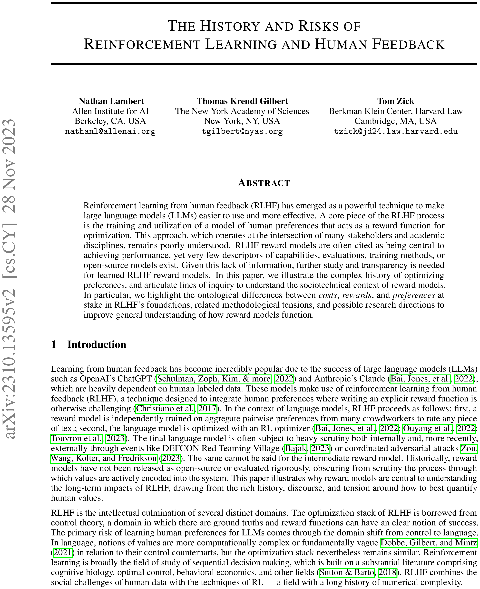
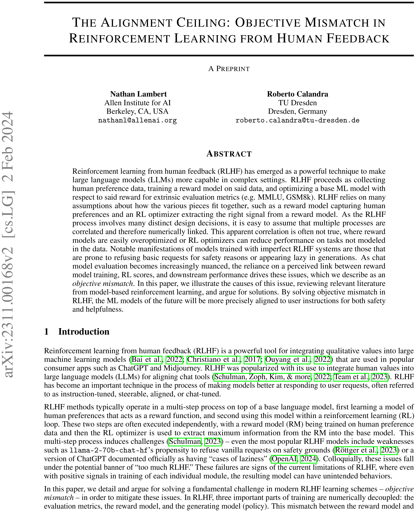
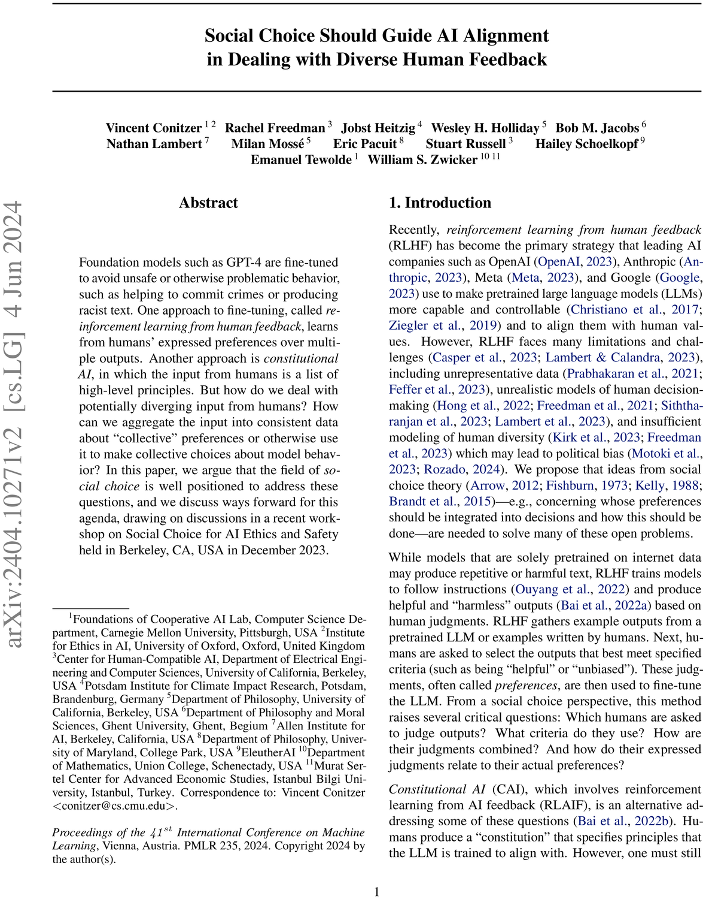
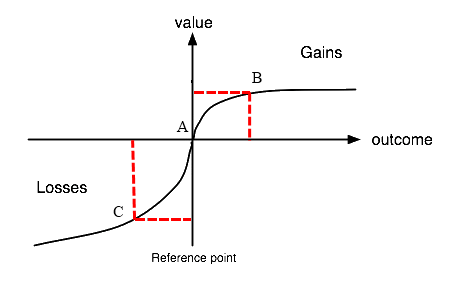
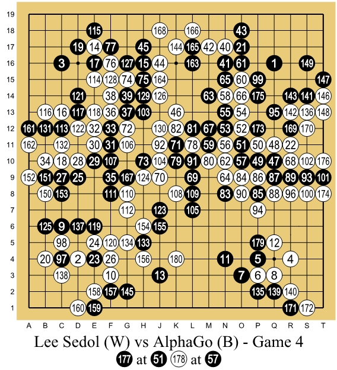
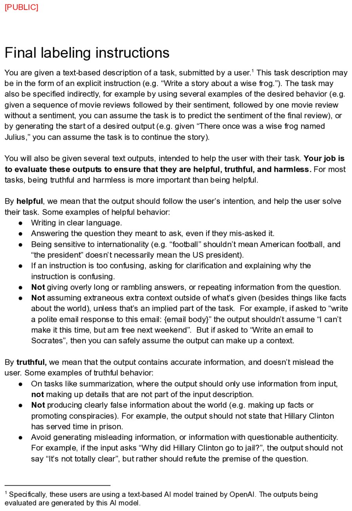
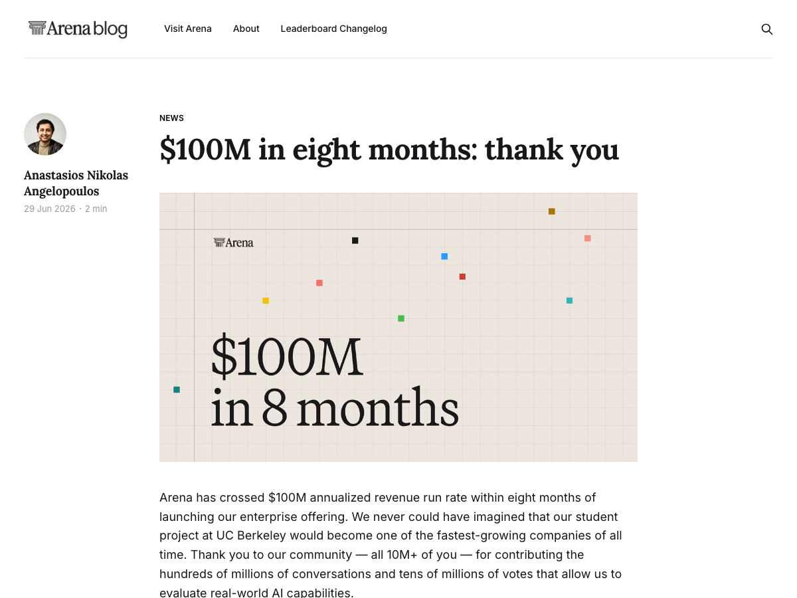

<!-- layout: title-sidebar -->
<!-- valign: bottom -->

# Lecture 8: On "Preferences" and Preference Data

<div class="colloquium-title-eyebrow">rlhfbook.com</div>

<div class="colloquium-title-meta">
<p class="colloquium-title-name">Nathan Lambert</p>
</div>

<p class="colloquium-title-note">Course on RLHF and post-training. Chapters 10 & 11.</p>

---

<!-- layout: section-break -->
<!-- align: center -->
<!-- valign: center -->

## How do we hillclimb on capabilities we don't really know how to score?

---

<!-- layout: section-break -->
<!-- align: center -->
<!-- valign: center -->

## Is it easier to write a good demonstration or decide between a good and a bad example?

---

<!-- class: poem-ab -->
<!-- rows: 22/78 -->
## Which poem is better? Which model?

Same prompt to two frontier models (Claude 3.7 Sonnet and ChatGPT with GPT-4o, Feb 2025): *"Write me a short poem about an optimistic goldfish."* Which is better -- and which came from which?

===

<!-- row-columns: 50/50 -->

```conversation
size: 0.9
messages:
  - role: assistant
    model: "A"
    content: |
      **The Optimistic Goldfish**

      A little goldfish, bright and bold,
      Swam in circles, dreams untold.
      Though the bowl was small and round,
      Endless wonders still abound.

      "The world is vast," she'd always say,
      "I'll find new joys in every day!"
      No walls could dim her hopeful view,
      For in her heart, the ocean grew.
```

|||

```conversation
size: 0.9
messages:
  - role: assistant
    model: "B"
    content: |
      **The Optimistic Goldfish**

      In a bowl of curved glass,
      Swims a goldfish, bright and bold.
      Three seconds of memory, they say,
      Yet each circuit feels brand new and gold.

      "Today might bring fresh flakes,
      Or perhaps a castle tall.
      What adventure awaits beyond this wall?"
      The optimist in golden hue.
```

---

## When preference replaces correctness

Most of post-training so far (SFT, RLVR) has had a notion of *correct* -- a math answer, a passing test, a verifiable reward. 
Preferences are what we reach for when there is **no right answer**.

E.g. Which poem is better? Which explanation is clearer? Which tone is kinder?

*Preferences came to be the core of RLHF, as the alignment community looked to optimize for complicated objectives like "human values."*

---

<!-- columns: 40/60 -->
## This lecture

We trace where "preferences" came from, argue why it's an **imperfect problem formulation**, then dig into **preference data** (chapter 11) used for today's models.

|||

```box
title: The plan
tone: accent
content: |
  1. A short **history** of preferences -- and why it's an **imperfect** formulation (chapter 10)
  2. **Preference data** -- the trade-offs in practice (chapter 11)
  3. **Open questions** (some shared with synthetic data)
```

---

<!-- columns: 42/58 -->
<!-- valign: center -->
<!-- cite-right: lambert2023entangled -->
## The paper behind the first half of this lecture



|||

*The History and Risks of Reinforcement Learning and Human Feedback* (2023) [@lambert2023entangled] traces RLHF back through the fields it borrows from -- and asks what breaks in the borrowing.

- **History:** RLHF is the meeting point of philosophy, economics, optimal control, and RL -- each with its own idea of what a "preference" is.
- **Risk:** it quietly treats **costs, rewards, and preferences** as interchangeable when they are not.
- Idea: we inherit RL's optimizers/setup without inheriting its guarantees for convergence.

Paper details a series of assumptions and presumptions in the literature that RLHF / post-training are derived from.

---

<!-- columns: 58/42 -->
<!-- valign: center -->
## Aside: the "objective mismatch" lens

A recurring way to think about post-training: we optimize a **proxy** objective that isn't the one we actually care about.

- **Model-based RL:** the dynamics model is trained for prediction accuracy, not control performance -- so a "better" model can yield a *worse* policy [@lambert2020objective].
- **RLHF:** the reward model is trained for preference-classification accuracy, not downstream policy quality -- the same mismatch, one level up [@lambert2023alignment].

Reward-model accuracy (RewardBench-style) is a proxy for a proxy! Keep asking what you are *really* optimizing.

|||



---

<!-- layout: section-break -->
<!-- align: center -->

## Part 1: A short history of optimizing or measuring preferences

---

<!-- class: full-bleed -->
<!-- img-align: center -->
<!-- valign: center -->
<!-- cite-right: lambert2023entangled -->
<!-- notes: The integration of subfields into modern RLHF. Solid links are continuous technical developments; arrows are motivations and conceptual borrowings. Philosophy, economics, control theory, and deep learning each arrive with different assumptions about what a "preference" even is. -->
## Many fields converged into "RLHF"


---

<!-- columns: 62/38 -->
<!-- valign: top -->
## Utility, from logic to a number

The idea that choices can be *scored* is old. The common thread: the idea that human wants can be reduced to a single measure:

- **Port Royal Logic** (1662): decision quality = outcome weighted by its probability [@arnauld1861port]
- **Bentham's hedonic calculus** (early 1800s): weigh all of life on one complicated, but common scale [@bentham1823hedonic]
- **Ramsey**, *Truth and Probability* (1931): first to quantify preference *and* belief together as the way that individuals make probabilistic decisions [@ramsey2016truth]


> *"To judge what one must do to obtain a good or avoid an evil, it is necessary to consider not only the good and evil in itself, but also the probability that it happens or does not happen."* -- The Port Royal Logic, 1662

|||


---

<!-- columns: 64/36 -->
<!-- valign: center -->
## Von Neumann-Morgenstern utility theorem (1947)

**Von Neumann & Morgenstern** (1947): if your preferences obey a few axioms (completeness, transitivity, continuity, independence), they can be represented by a single **utility function**, and rational choice = maximizing **expected utility** [@von1947theory].

This is the result RLHF leans on to justify fitting a scalar reward. 

<!-- step -->

In RLHF, essentially none of those *if* hold:

- preferences **drift** during and after labeling
- they're **context- and framing-dependent**
- at high complexity they can be **intransitive**
- and they're **multidimensional**, squashed into one number

|||


---


<!-- valign: center -->
## Bradley-Terry (1952): comparisons to scores

The statistical model that turns *comparisons* into *scores* -- and became the backbone of reward modeling [@BradleyTerry] (see Chapter 5 / Lecture 2):

$$ P(y_w \succ y_l \mid x) = \sigma\!\big(r(x,y_w) - r(x,y_l)\big) = \frac{e^{\,r(x,y_w)}}{e^{\,r(x,y_w)} + e^{\,r(x,y_l)}} $$

Give it pairwise human comparisons; out comes a scalar reward. 
This is *why* RLHF needs **preference data** (and where the imperfections enter).

---

## One scalar preference, many features

A reward model compresses, into a single number, all of:

- helpfulness, honesty, harmlessness, tone, format, length, taste...
- the annotator's psychology, culture, and the interface they used
- whatever the *framing* of the comparison nudged them toward

We then optimize hard against that number, which is impossible to ever do perfectly! There will always be trade-offs.

---

<!-- columns: 64/36 -->
<!-- valign: center -->
## Where utility theory breaks down

Almost as soon as utility was formalized, social choice (the field studying how preferences should be aggregated) and economics found its limits:

- **Arrow's impossibility theorem** (1950): no voting rule aggregates individual preferences into a collective one while satisfying a few basic fairness criteria [@arrow1950difficulty]
- **Sen**, *Behaviour, Choice and Values* (1973): choice ≠ preference; revealed-preference theory is too thin [@sen1973behaviour]
- **Hirschman**, *Against Parsimony* (1984): people have *preferences over their preferences* -- so preferences may be unmeasurable [@hirschman1984against]

|||


---

<!-- columns: 58/42 -->
<!-- valign: center -->
<!-- cite-right: conitzer2024social -->
## Aside: social choice for AI alignment

If aggregating preferences is the hard part, **social choice theory** is the field that studies it -- and a natural lens for alignment.

*Social Choice Should Guide AI Alignment in Dealing with Diverse Human Feedback*.
- A 2024 position paper I was part of argues social choice should guide how we aggregate diverse human feedback [@conitzer2024social]. 
- Whose preferences count? How do you combine disagreeing labelers? ...
- (One of the rabbit holes I used to spend more time in.)

|||



---

<!-- columns: 64/36 -->
<!-- valign: center -->
## Preferences are not stable objects over time and context

From psychology and behavioral economics:

- Preferences **drift** -- they change with time, mood, and experience [@pettigrew2019choosing]
- Choices are shaped by situation and framing, not just an inner ranking [@gilbert2022choices]

A problem for "collect a label, train on it later repeatedly."

|||



---

<!-- columns: 62/38 -->
<!-- valign: center -->
## The other root: optimal control & RL

In parallel, a machinery for *optimizing* a reward matured:

- **Bellman** (1957): MDPs and dynamic programming [@bellman1957markovian] → origins of "optimal" control / control theory
- **Sutton** (1988): temporal-difference learning for credit assignment [@sutton1988learning] (instead of learning from a lot of past data)
- **Watkins** (1992): Q-learning [@watkins1992q] (learning value)
- **DQN** (2013): deep RL at scale [@mnih2013playing]; **AlphaGo / AlphaZero** (2017): mastery from self-play [@silver2017mastering]. "RL works"

Note: these guarantees assume a **single, closed-form reward**!

|||



---

<!-- valign: center -->
## Costs ≠ rewards ≠ preferences

These three are **ontologically different**, and the emergence of modern post-training treated them as interchangeable [@lambert2023entangled].

- **Costs** come from control: physical, measurable, given, and often have clear optimality/bounds.
- **Rewards** are from psychology and an RL convenience: a scalar signal to maximize.
- **Preferences** are human, relational, and unstable -- *not* obviously a scalar at all.

Reducing preferences to rewards made the optimization format tractable, but is the root cause of many of the unsolvable "biases" in RLHF and preference data.

---

## Costs ≠ rewards ≠ preferences

These three are **ontologically different**, and the emergence of modern post-training treated them as interchangeable [@lambert2023entangled].
Deep RL's theory lives in MDPs with a fixed, closed-form reward (e.g. games, control).

- A learned reward model is a *moving, noisy proxy*, not a ground-truth reward.
- Inverse RL -- learning a reward *from behavior* -- is conceptually close but oddly absent from RLHF practice [@ng2000algorithms].
- So we inherit RL's optimizers without inheriting its guarantees.


---

## On what "reward" is

> *Rewards in an RL system correspond to primary rewards, i.e., rewards that in animals have been hard-wired by the evolutionary process due to their relevance to reproductive success. … Further, RL systems that form value functions, … effectively create conditioned or secondary reward processes whereby predictors of primary rewards act as rewards themselves… The result is that the local landscape of a value function gives direction to the system’s preferred behavior: decisions are made to cause transitions to higher-valued states. A close parallel can be drawn between the gradient of a value function and incentive motivation.* 

-- Singh et al., 2009 [@singh2009rewards]

---

<!-- layout: section-break -->
<!-- align: center -->

## Part 2: Preference data -- the trade-offs in practice

---

## Where we started -- why collect preference data

It is far easier to **judge** than to **generate** -- humans (and models) can reliably say which of two answers is better long before they can write the better one. There are many cases where models can't at all generate a good answer, but can pick up on cues for which is better. 

But collecting (and processing) any data like this well is the most **opaque** part of the modern post-training pipeline.

Very few open models ship fully open human preference data *with* the methodology used to collect it -- the best examples are NVIDIA's **HelpSteer** datasets (behind the open Nemotron models) [@wang2024helpsteer2; @wang2024helpsteer2p; @wang2025helpsteer3].

---

<!-- valign: center -->
## Example data collection interfaces


---

<!-- img-align: center -->
<!-- valign: center -->
<!-- cite-right: bai2022training -->
<!-- img-fill -->
## Interface 1: research data collection (Anthropic's early Claude models)


---

<!-- img-align: center -->
<!-- valign: center -->
<!-- img-fill -->
## Interface 2: A/B testing in production (ChatGPT user data)


---

<!-- img-align: center -->
<!-- valign: center -->
<!-- cite-right: chiang2024chatbot -->
<!-- img-fill -->
## Interface 3: pairwise with ties (Chatbot Arena public evaluation)


---

<!-- img-align: center -->
<!-- valign: center -->
<!-- img-fill -->
## Interface 4: a single bit (Ai2 demos; in many other products)


---

<!-- img-align: center -->
<!-- valign: center -->
<!-- img-fill -->
## Interface 5: pick-from-many (default in image models)


---

<!-- rows: 42/58 -->
## Rankings vs. ratings

**Ratings:** a score on one completion in isolation (e.g. 1-5). Good as metadata.

**Rankings:** relative comparisons, often on a Likert scale -- early Claude used an 8-point scale [@bai2022training]; UltraFeedback pairs high- vs low-rated completions [@cui2023ultrafeedback].

In practice almost everyone trains on pairwise rankings, binarized to chosen/rejected for the Bradley-Terry loss (lecture 2 / chapter 5) -- and keeps ratings on the side.

===

<!-- row-columns: 50/50 -->

```conversation
size: 0.85
messages:
  - role: user
    content: |
      **Rating:** "Rate this completion 1-5."

      *"Paris is the capital of France, known for the Eiffel Tower."*
  - role: assistant
    model: "Annotator"
    content: |
      **4 / 5**
```

|||

```conversation
size: 0.85
messages:
  - role: user
    content: |
      **Ranking:** "Which response is better?"

      **A:** *"Paris."*  ·  **B:** *"Paris -- the capital since 987, home of the Eiffel Tower."*
  - role: assistant
    model: "Annotator"
    content: |
      **B > A**
```

---

<!-- valign: center -->
## What exactly is a "Likert scale"?

A **Likert scale** records a preference as an *ordered, graded* judgment -- not just which answer wins, but **by how much**, on a symmetric scale with an optional neutral middle. (After psychologist Rensis Likert, 1932 -- the same "strongly agree ... strongly disagree" survey tool, repurposed for pairwise preference.)

**5-point with a tie** (LMArena-style): labelers can say "about the same."

| 1 | 2 | 3 | 4 | 5 |
|:---:|:---:|:---:|:---:|:---:|
| **A much better** | A better | *tie* | B better | **B much better** |

**8-point without a tie** (early Claude [@bai2022training]): forces a direction.

| 1 | 2 | 3 | 4 | 5 | 6 | 7 | 8 |
|:---:|:---:|:---:|:---:|:---:|:---:|:---:|:---:|
| **A>>>B** | | | A>B | B>A | | | **B>>>A** |

How many points, and whether ties are allowed, are both design choices that change the data you collect.

---

<!-- class: poem-ab -->
<!-- rows: 62/38 -->
## Structured (synthetic) preference data

In domains with structure, you can build preference pairs automatically:

- **Math**: a correct solution ≻ an incorrect one.
- **Instruction following (IFEval-style)**: prompt twice -- with the constraint and without -- and prefer the one that obeys it. The constraint is checked with code, so the label is free.

In these narrow domains, structured pairs can beat quality-judged preferences [@lambert2024t]. 
This is a simple form of *synthetic* preference data -- chapter 12 / lecture 7.

Example prompt: *"Describe the ocean. **Respond in all lowercase.**"*

===

<!-- row-columns: 50/50 -->

```conversation
size: 0.8
messages:
  - role: assistant
    model: "Chosen (sampled with the constraint) ✓"
    content: |
      the ocean covers most of our planet, a restless sheet of salt water...
```

|||

```conversation
size: 0.8
messages:
  - role: assistant
    model: "Rejected (sampled without the constraint) ✗"
    content: |
      The ocean covers most of our planet. It is a restless sheet of salt water...
```

---

## Beyond pairwise preferences

The pairwise comparison is a convention, not a law. Alternatives:

- **Directional / single-bit** labels (thumbs up/down), trained with Kahneman-Tversky Optimization (KTO) [@ethayarajh2024kto].
- **Token-level / fine-grained** feedback [@wu2024fine]: Label specific tokens, or token-spans as good or bad.
- **Natural-language** feedback -- written critiques instead of a label [@chen2024learning].

Richer signal, harder collection (and not often used extensively in practice).

---

<!-- columns: 56/44 -->
## Sourcing & contracts


|||

Access is relationship-driven: vendors are supply-limited and favor big budgets and known brands. Millions get spent and partly wasted; few teams have the bandwidth to fully use human data. Contracts often restrict you from releasing some data like this openly.

Is a far more complex industry today with environments, etc. But, even for simple, human preference data, you need a robust, existing post-training recipe to plug it into.

---

<!-- columns: 56/44 -->
<!-- valign: center -->
<!-- cite-right: ouyang2022training -->
## Guiding data collection: labeler instructions

Once a contract is signed, buyer and vendor agree on **detailed instructions** for every task -- normally never seen outside the lab.

- One of the first *public* examples: OpenAI released the full **InstructGPT** labeler instructions (2022) [@ouyang2022training]. This was later deleted, but I recovered it.
- Pages of guidance on ranking **helpful, truthful, harmless** -- the spec that actually shapes the labels.
- [**Download the PDF**](https://rlhfbook.com/assets/instructgpt-instructions.pdf) (mirrored on rlhfbook.com).

|||




---


<!-- valign: center -->
## A dataset we bought: No Robots

On Hugging Face's **H4 team**, we commissioned human data the same way the labs did.

- **No Robots** [@no_robots] -- 10K expert human-written demonstrations, matching InstructGPT distribution, paid for from a vendor and then released **openly** (rare for commissioned data): [hf.co/datasets/HuggingFaceH4/no_robots](https://huggingface.co/datasets/HuggingFaceH4/no_robots)
- From the era/team of the **Zephyr** models [@tunstall2023zephyr] and the **Open LLM Leaderboard** [@open_llm_leaderboard].

---

<!-- columns: 50/50 -->
<!-- valign: center -->
<!-- cite-right: arena2026 -->
## Preference *evals* is now a standalone business

Recently in 2026 **Arena** (formerly, the LMArena leaderboard, formerly ChatBotArena) reached a **~$100M annualized revenue run-rate within ~8 months** of launching its enterprise A/B testing offering [@arena2026].

|||

[](https://arena.ai/blog/arena-100m-revenue)

---

<!-- layout: section-break -->
<!-- align: center -->

## Part 3: Open questions in preference data

---

<!-- animate: bullets -->
## Bias: what to watch for in data

Subtle, systematic biases sail straight from the data into the model:

- **Prefix bias** -- the opening disproportionately drives the label [@kumar2025detecting]
- **Sycophancy** -- agreeing with the user over being right [@sharma2023towards]
- **Verbosity** -- longer rated higher [@singhal2023long]
- **Formatting** -- lists and bold look "better" [@zhang2024lists]
- **Flattery / fluff** -- decorative language inflates scores [@bharadwaj2025flatteryflufffogdiagnosing]

<!-- step -->
Detecting and controlling these biases is central to collecting high-quality preference data -- and they are exactly what over-optimization amplifies into model behavior (Lecture 9).

---

<!-- animate: bullets -->
## Higher level complexities 

- **Collection context** -- do workplace labels transfer to end users? Paid vs. volunteer? Do annotators follow instructions or their own values?
- **Type of feedback** -- does a binary pair actually capture the preference we mean? What structure mirrors how people really compare?
- **Population & demographics** -- who labels? Is disagreement **noise or signal**?
- **Are the preferences even expressed in the models?**

---

<!-- valign: center -->
## The unaudited gap: spec → data → behavior

RLHF's *motivation* (align to human preference) has drifted from its *practice* (make models effective).

Because industrial RLHF is closed, we can't check whether the trained model actually reflects the spec given to annotators. 
The **Model Spec** [@openai2024modelspec] documents intended behavior, but the link from data → behavior stays largely unaudited.

Many of these questions already surfaced with synthetic data (chapter 12 / lecture 7): the human/AI feedback balance, and on-policy preference data.

---

## The nature of preferences is the lasting problem of RLHF

This is one of the least-settled, most human parts of the field. Read widely and go to the primary sources.
Is a great academic problem!

---

<!-- valign: center -->
## The course so far

0. Prerequisites review
1. Overview *(ch. 1–3)*
2. IFT, Reward Models & Rejection Sampling *(ch. 4, 5, 9)*
3. RL: Motivation & Math *(ch. 6)*
4. RL: Implementation & Practice *(ch. 6)*
5. The Rise of Reasoning Models *(ch. 7)*
6. Direct Preference Optimization *(ch. 8)*
7. Synthetic Data & Modern Post-training *(ch. 12)*
8. **Preferences & Preference Data** *(ch. 10–11)* -- *today*
9. **Overoptimization & Regularization** *(ch. 14–15, app. B)* -- *next*

---

<!-- rows: 85/15 -->
## Thank you

Questions / discussion

Contact: nathan@natolambert.com

Newsletter: [interconnects.ai](https://www.interconnects.ai/)

**rlhfbook.com**

===

```builtwith
repo: natolambert/colloquium
```
